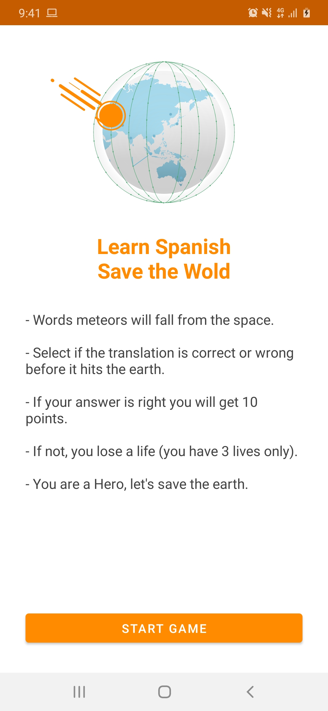
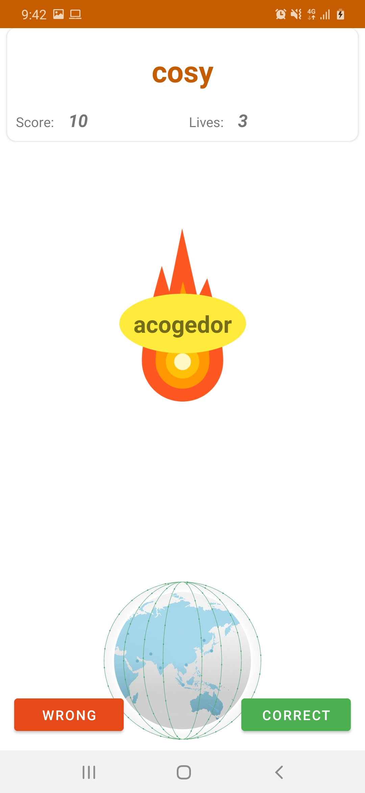
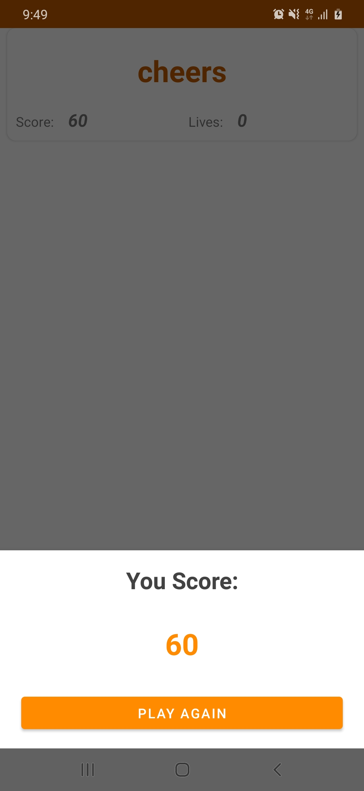
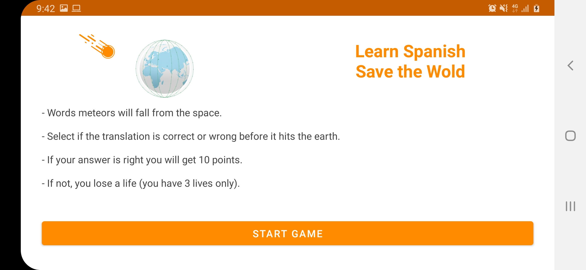
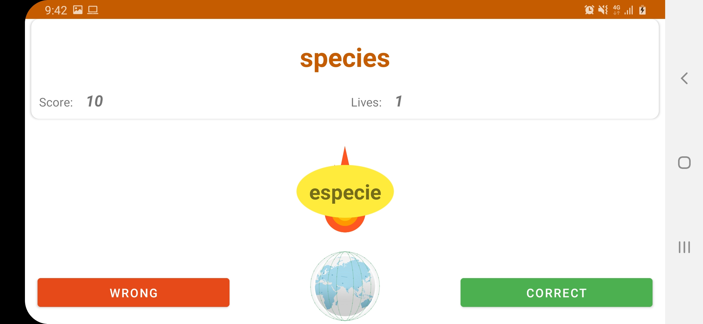
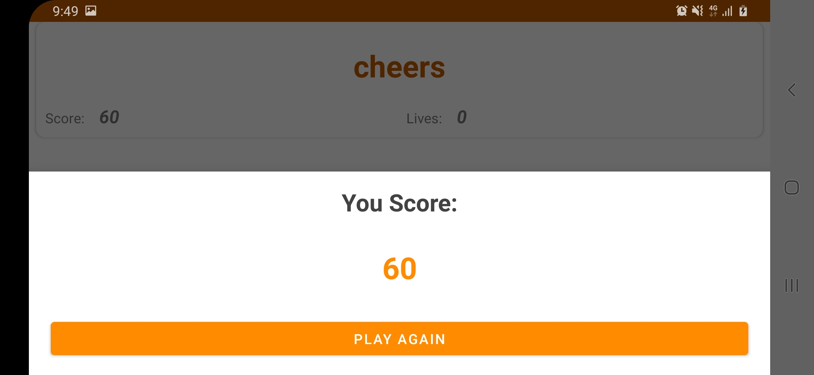

## Babbel Falling Words Challenge
This is an Android application for (Falling Words Game) as part of the technical assessment by [Babbel](https://www.babbel.com/)

## Technologies and Libraries
- Kotlin
- ViewModel and LiveData
- Kotlin Coroutines
- [View Binding](https://developer.android.com/topic/libraries/view-binding) for better performance and lighter weight compared to DataBinding
- Dagger2 for dependency injection
- Google Material Design
- [Lottie](https://lottiefiles.com/) for animation effects
- Testing: using JUnit, Espresso, and Mockito

## Architecture
- The app developed using MVVM architecture combined with Repository and Data-Source pattern to limit coupling between application layers and components which provides a better codebase to be more testable, maintainable and also scalable for new features and updates.

- GameViewModel contains the game logic and stores the data to survive the configuration changes like switching to landscape so user can continue the game smoothly. Also fetching words list from the repository using Kotlin Coroutines.

- WordsRepository representing data-layer using abstracted data-source to be maintainable and testable with different types of data-sources: local, remote or test-double for testing.

- The app contains three views with adaptive UI for landscape, portrait, and different screen sizes : 
    - TutorialActivity: introduction about the game and how to play.
    - GameActivity: contains the game interface and controls.
    - GameResultSheet: an action sheet shows when the game is over with the user score.

## Time Distribution
- I've spent about 7 hours on the app.
- (1 hour) for planning the game concept, base architecture and Dagger2 setup.
- (1:30 hour) for building views and game UI controls.
- (2:30 hour) for developing game logic and the data layer.
- (1:30 hour) for writing tests both unit-testing and UI-testing.
- (30 minutes) for documentation.

## To Improve
Due to time constraints, I wish I could improve the app with the following:
- Add constructive learning strategy so users learn new words by time with incremental levels.
- Introduce different levels of difficulty with more game elements (i.e: faster words fall - leader board)
- Creating background service to sync new words from the server to the app’s local database.
- Improve user experience for better interaction by adding sounds and vibration effects, with correction if the chosen word is wrong.
- Add a user dictionary where all the correct solved words saved, so users can get back to them any time.

## Screenshots
<table>
  <tr>
    <td></td>
    <td></td>
    <td></td>
  </tr>
  
   <tr>
    <td></td>
    <td></td>
    <td></td>
  </tr>
  
 </table>
